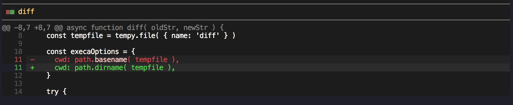

# string-diff-viewer

Compare two string and generate human-friendly output to stdout (based on [git-split-diffs](https://github.com/banga/git-split-diffs))



## Installation

```bash
npm i string-diff-viewer
```

## Usage

```js
import { diff } from 'string-diff-viewer'

const diffString = await diff( oldStr, newStr, {
  // show diff side by side(default: true)
  sideBySide: false,
  // See https://github.com/banga/git-split-diffs#themes
  theme: 'dark',
  // shiki syntax theme
  syntaxTheme: 'github-dark',
  // shiki language
  language: 'js',
  // filename displayed in header
  displayFilename: 'foo/bar.mjs',
  // total columns(default: <full term size>)
  columns: 100,
  // wrap lines or truncate them(default: true)
  wrapLines: true,
} )

console.log(diffString)
```

## Related

- [git-split-diffs](https://github.com/banga/git-split-diffs) - GitHub style split diffs in your terminal

## License

MIT
